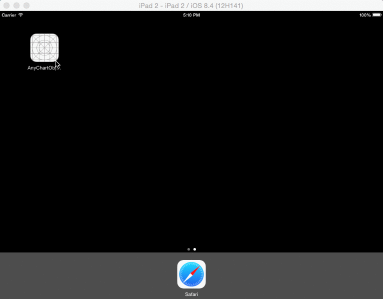
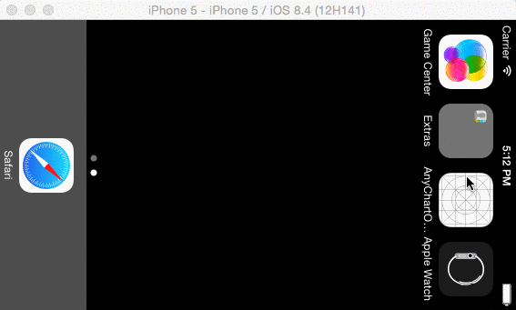

# anychart iOS Objective C sample
This example shows how to use AnyChart charting library in iOS application with SQLite database.

## Requirenments
* XCode 6+
* Cocoa Pods

## Preview

## Setup project
Run `pod install` before opening, then open AnyChartObjCSample xcode workspace.

## License
AnyChart iOS integration sample includes two parts:
- Code of the integration sample that allows to use Javascript library (in this case, AnyChart) with iOS. You can use, edit, modify it, use it with other Javascript libraries without any restrictions. It is released under [Apache 2.0 License](https://github.com/anychart-integrations/anychart-ios-objc-sample/blob/master/LICENSE).
- AnyChart JavaScript library. It is released under Commercial license. You can test this plugin with the trial version of AnyChart. Our trial version is not limited by time and doesn't contain any feature limitations. Check details [here](https://www.anychart.com/buy/).

If you have any questions regarding licensing - please contact us. <sales@anychart.com>
